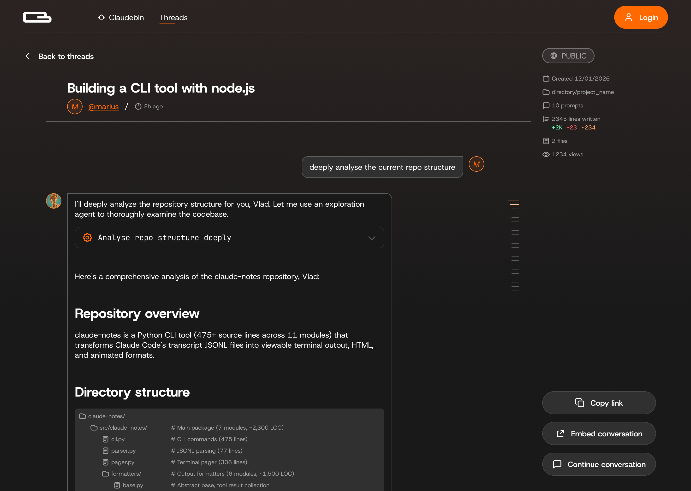

<p align="center">
  
</p>

<p align="center">
  Share your Claude Code sessions with teammates.
</p>

<p align="center">
  <a href="https://claudebin.com">Website</a> &middot;
  <a href="https://github.com/wunderlabs-dev/claudebin">Plugin</a> &middot;
  <a href="#getting-started">Getting Started</a>
</p>

<p align="center">
  <a href="https://www.producthunt.com/products/claudebin?embed=true&amp;utm_source=badge-featured&amp;utm_medium=badge&amp;utm_campaign=badge-claudebin" target="_blank" rel="noopener noreferrer"></a>
</p>

---

> **Web App** (this repo) - the Next.js frontend and API at [claudebin.com](https://claudebin.com)
>
> **Plugin** - the Claude Code plugin at [github.com/wunderlabs-dev/claudebin](https://github.com/wunderlabs-dev/claudebin)

## What it looks like

Publish any Claude Code session with a single command and get a shareable link - complete with syntax highlighting, tool calls, and the full conversation thread.

<p align="center">
  
</p>

## Getting Started

```bash
bun install    # Install dependencies
bun dev        # Start dev server
bun build      # Build for production
bun check      # Lint & format
```

### Environment Variables

```bash
NEXT_PUBLIC_SUPABASE_URL=
NEXT_PUBLIC_SUPABASE_ANON_KEY=
SUPABASE_SERVICE_ROLE_KEY=
OPENROUTER_API_KEY=             # For title generation
```

For self-hosted Docker OAuth setup, follow [docs/google-oauth-docker-setup.md](docs/google-oauth-docker-setup.md).

### Local Development with the Plugin

1. Start the web app: `bun dev` (runs on port 3000)
2. Build the plugin:
   ```bash
   cd /path/to/claudebin/mcp && bun install && bun run build
   ```
3. Run Claude with the local plugin:
   ```bash
   CLAUDEBIN_API_URL=http://localhost:3000 claude --plugin-dir /path/to/claudebin --dangerously-skip-permissions
   ```

## Docker

Run the full stack locally with Docker Compose, including Supabase (PostgreSQL, Auth, Storage, API).

### Quick Start

```bash
# 1. Setup Supabase docker files and .env
./scripts/docker-setup.sh

# 2. Start all services (builds app, runs migrations, starts Supabase)
docker compose up -d

# 3. View logs
docker compose logs -f app
```

### Services

| Service | URL | Description |
|---------|-----|-------------|
| App | http://localhost:3000 | Claudebin web app |
| Supabase API | http://localhost:8000 | REST/Auth API (Kong) |
| Supabase Studio | http://localhost:3001 | Database admin UI |

### Migrations

Migrations run automatically when starting with `docker compose up`. The `migrations` service:

1. Waits for the database to be healthy
2. Creates a `schema_migrations` tracking table
3. Applies any unapplied SQL files from `supabase/migrations/`
4. Records each applied migration to prevent re-running

**Run migrations manually** (if needed):

```bash
# Re-run the migrations container
docker compose run --rm migrations

# Or apply a specific migration directly
docker compose exec db psql -U postgres -d postgres -f /path/to/migration.sql
```

**Check migration status:**

```bash
docker compose exec db psql -U postgres -d postgres \
  -c "SELECT * FROM schema_migrations ORDER BY applied_at;"
```

### Common Commands

```bash
# Start in foreground (see all logs)
docker compose up

# Start in background
docker compose up -d

# Rebuild after code changes
docker compose up --build -d

# Stop all services
docker compose down

# Stop and remove volumes (full reset)
docker compose down -v

# View app logs
docker compose logs -f app

# Access database shell
docker compose exec db psql -U postgres -d postgres
```

### OAuth Setup

For Google and GitHub OAuth in Docker, see [docs/google-oauth-docker-setup.md](docs/google-oauth-docker-setup.md).

## Architecture

```
claudebin.com/
├── app/                  # Next.js 16 web application
│   └── src/
│       ├── app/          # Pages and API routes
│       ├── components/   # UI components
│       ├── containers/   # Page containers
│       ├── server/       # Backend logic
│       │   ├── actions/  # Server actions (mutations)
│       │   ├── repos/    # Data access (Supabase)
│       │   ├── services/ # Business logic
│       │   └── api/      # OpenAPI schemas
│       └── context/      # React context providers
└── supabase/             # Database migrations
```

### Routes

| Route | Description |
|---|---|
| `/` | Homepage with featured threads |
| `/threads` | Browse public threads |
| `/threads/[id]` | View a session |
| `/threads/[id]/embed` | Embeddable version |
| `/profile/[username]` | User profile |
| `/auth/login` | Google and GitHub OAuth |

### API

OpenAPI spec at `/api/openapi.json`.

| Endpoint | Method | Description |
|---|---|---|
| `/api/auth/start` | `POST` | Start CLI auth flow |
| `/api/auth/poll` | `GET` | Poll for auth completion |
| `/api/auth/refresh` | `POST` | Refresh access token |
| `/api/auth/validate` | `GET` | Validate access token |
| `/api/sessions/publish` | `POST` | Publish a session |
| `/api/sessions/poll` | `GET` | Poll processing status |
| `/api/threads/[id]/messages` | `GET` | Get thread messages |
| `/api/threads/[id]/md` | `GET` | Get thread as markdown |

### Session Processing Pipeline

```
Plugin uploads JSONL ─→ Store in Supabase Storage ─→ Parse into messages ─→ Generate title (LLM) ─→ Ready
```

### Database

PostgreSQL with Row Level Security. Auto-profile creation on signup, denormalized counts via triggers, and full-text search on message content.

| Table | Description |
|---|---|
| `profiles` | User data synced from `auth.users` |
| `sessions` | Published threads with view/like counts |
| `messages` | Parsed conversation messages |
| `session_likes` | User likes |
| `cli_auth_sessions` | Temporary CLI OAuth tokens |

## Tech Stack

| | |
|---|---|
| **Framework** | Next.js 16, Turbopack |
| **Database** | Supabase (PostgreSQL) |
| **Auth** | Supabase Auth, Google OAuth, GitHub OAuth |
| **Styling** | Tailwind CSS, shadcn/ui |
| **Tooling** | Bun, Biome |

## License

MIT
